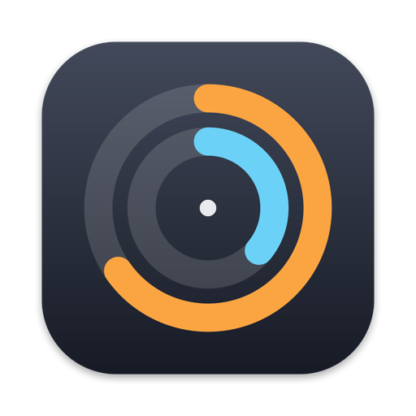
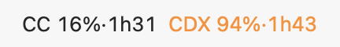
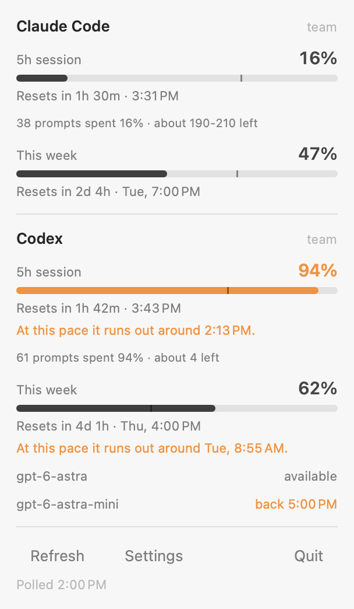

# AI CLI Limits

A macOS menu bar readout of how much of your Claude Code and Codex rate-limit
windows you have left, and when each one resets. It costs no tokens: the numbers
come from each tool's own usage endpoint, and nothing is ever sent to a model.

<picture>
  <source media="(prefers-color-scheme: dark)" srcset="docs/menubar-dark.png">
  
</picture>

`CC` is Claude Code and `CDX` is Codex. Each shows how much of the 5-hour window
is spent and how long until it resets, and each is coloured on its own, so one
can go red while the other stays quiet.

Click it for both windows of both tools, the reset times, roughly how many
prompts are left, and which Codex models are currently available.

<picture>
  <source media="(prefers-color-scheme: dark)" srcset="docs/panel-dark.png">
  
</picture>

The figures in both pictures are samples, drawn by the same code that draws
the real thing.

## Install

Needs macOS 14 or later and Apple's command line tools. If you do not have them,
macOS will offer to install them when you run `xcode-select --install`.

One line, which clones the repository to a temporary folder and builds from it:

```
curl -fsSL https://raw.githubusercontent.com/sujithps/Ai-CLI-Limits/main/install.sh | bash
```

Or clone it and run the same script from inside:

```
git clone https://github.com/sujithps/Ai-CLI-Limits.git
cd Ai-CLI-Limits
./install.sh
```

Either way it compiles the app, puts it in `~/Applications`, and starts it. Run
it again any time to upgrade; it stops the running copy first. `make install`
does the same thing from a clone.

To remove it and everything it stored:

```
./uninstall.sh
```

Building it yourself is also the path of least resistance on an unsigned app: a
copy downloaded from the web picks up a quarantine flag and Gatekeeper blocks
it, while a locally built one just runs.

## Menu bar colours

Each provider is coloured on its own, so a red Claude chunk can sit beside a
calm Codex one.

| Colour | Meaning |
|---|---|
| default | nothing to act on |
| green | the 5h window resets within 30 minutes and over 40% of it is unused, so spend it now or lose it |
| orange | 80% of the 5h window, or 80% of the week, is gone |
| red | 95% of the 5h window, or 90% of the week, is gone |

The colour is redundant with the numbers beside it, so nothing is lost if you
cannot tell the shades apart.

## Prompts left

Neither provider reports tokens or prompts remaining, and their limits are not
denominated in tokens, so there is nothing to read directly. The fields exist
and are empty: Claude returns `limit_dollars`, `used_dollars` and
`remaining_dollars` as null, and the Codex `credits.approx_local_messages`
figure only fills in for accounts holding credits.

What can be measured is the other half of the division. Each CLI logs its own
prompts locally, so counting the ones inside the current window turns the
provider's percentage into a cost per prompt:

| | Counted from |
|---|---|
| Claude Code | human turns in `~/.claude/projects/**/*.jsonl`, excluding tool results |
| Codex | rows in `thread_turns` in `~/.codex/thread_history_*.sqlite` |

Both halves are real numbers. The estimate is still a division of two rounded
figures, so it is shown as a range and rounded down to the precision it has:
`10 prompts spent 4% · about 210-280 left`.

Its limits, which is why it is worded as an estimate:

- Percentages arrive as whole numbers, so early in a window the range is wide.
  Below 2% used it is not shown at all.
- Cost per prompt varies enormously with how much work a prompt triggers. In
  one sample of 185 measured Codex turns the per-turn cost ranged from 1% to
  44% of the window, median 2%.
- Only prompts logged on this machine are counted. Quota spent from claude.ai,
  the Codex desktop app or another Mac makes each prompt look more expensive
  than it was, which errs toward under-promising.

## Where the numbers come from

Neither provider is asked to generate anything, so this costs no tokens and
does not touch your usage.

| | Credentials | Endpoint |
|---|---|---|
| Claude Code | Keychain item `Claude Code-credentials` | `~/.claude.json` first, `GET api.anthropic.com/api/oauth/usage` only as a fallback |
| Codex | `~/.codex/auth.json` | `GET chatgpt.com/backend-api/wham/usage` |

Both are read-only. The app never writes or refreshes a token: rotation belongs
to the two CLIs, and racing them would invalidate a working login. When a token
does expire the app shows "not signed in" until you next use that CLI, which
refreshes it.

## Polling and throttling

Every 10 minutes, plus on wake, plus on opening the panel if the last read is
over 2 minutes old. Neither percentage moves fast enough to need more: 10
minutes is 3% of a 5-hour window, and the countdowns are computed locally from
the reset time, so they stay exact between polls. Refresh forces a read.

The Claude usage endpoint throttles on a budget shared with Claude Code's own
polling, and once tripped it stayed 429 for over 25 minutes. Sending the CLI's
own `User-Agent` and `x-app: cli` made no difference, so the cooldown is on the
account, not the client.

So the app mostly does not call it. Claude Code writes every usage response it
receives into `cachedUsageUtilization` in `~/.claude.json`, and those numbers
can only move while Claude Code is running, which is exactly when that cache
gets refreshed. The app reads the cache and makes no request at all, as long as
the cached session window has not already reset, the read is under two hours
old, and it is not older than a live read the app already holds. Failing any of
those it calls the endpoint, and if that call fails it keeps whichever figure is
newest and says when it was read.

The budget is tight enough that two reads a minute apart can trip it, so the
cache path matters. A measured recovery: 429 from 17:05, still 429 after six
once-a-minute retries, back to 200 after 15 minutes of silence.

When a read does come back 429 the app keeps the last good numbers on screen,
marks them with the time they were read, and backs off per provider: 10 minutes,
then 20, then 30, resetting on the first success. A throttled Claude does not
stop Codex from updating. The last good reading is saved to disk, so a restart
mid-throttle still shows numbers rather than an error, and is dropped once the
window it describes has reset.

A 429 here is the usage endpoint refusing to be read. It is a separate limit
from the one being reported and does not touch your Claude Code or Codex quota.

## Pace

The meter fills with usage. The vertical tick sits at how much of the window has
elapsed. Fill behind the tick means you are using the window slower than the
clock is spending it; fill past the tick means you will run out early, and the
panel says roughly when.

## Notifications

Each of these can be turned off under Settings in the panel:

- a 5-hour window resets
- a 5-hour window crosses 50, 80, 95 or 100%
- a 5-hour window is within 30 minutes of resetting with more than 40% unused
- the weekly limit crosses 75, 90 or 100%
- a Codex model becomes available or unavailable

Nothing fires on the first poll after install, so you do not get a backlog.

## Privacy

Everything stays on the machine. The app reads credentials the two CLIs already
wrote, calls each provider's own usage endpoint, and writes nothing anywhere
else. There is no analytics, no telemetry and no third party. Tokens are used
to sign a request and are never logged or stored by this app.

## Known gaps

- Codex has no local cache to fall back on, the way Claude has
  `~/.claude.json`. Its own rollout logs carry `rate_limits` on every turn and
  could serve the same purpose.
- The prompts-left estimate covers the 5-hour window only. The weekly window
  needs a count over seven days of logs.
- The build is ad-hoc signed, so macOS treats it as an unidentified developer.

## Building by hand

`./build.sh` compiles straight to `~/Applications/AI CLI Limits.app`, or to a
path you pass it. There are no dependencies beyond the command line tools.

The macOS 27 command line tools ship a SwiftUI whose property wrappers are
macros but not the plugin that expands them, so `@State` fails to compile
against the default SDK. The build script notices and falls back to the newest
older SDK still installed beside it, and says so. If none is left, install Xcode
or an earlier command line tools package.

`./shots.sh` redraws the pictures above from the views the app actually
installs, so they cannot drift from the code. It uses fixed sample figures;
pass `--live` to draw your own usage instead.

`./icon.sh` redraws the app icon from `Tools/Icon.swift`.

## Tests

```
./test.sh
```

or `make test`. Arguments pass through to `swift test`, so `./test.sh --filter
Prompts` runs one area. The tests use Swift Testing, which the command line
tools include; XCTest is not, so nothing here needs Xcode.

`Package.swift` exists only for the tests: Swift Package Manager cannot produce
an app bundle, so the app itself still comes from `build.sh`, and the two
compile the same files.

What is covered is the logic that does not need an account or a screen: the
window arithmetic and burnout projection, the prompts-left range and its
rounding, the colour thresholds, the parsers for both usage endpoints and for
Claude Code's cache file, the prompt counters against fixture transcripts and a
fixture Codex database, and the text and colours of the menu bar title. The
network calls, the Keychain, notifications and the panel are not under test.

On first launch macOS asks to allow notifications.

The `Claude Code-credentials` Keychain item is read once per launch, the first
time a live Claude call is needed, and the token is then held in memory. It is
read again only when the API rejects the held token, which is what a rotation
by Claude Code looks like. Choose Always Allow at the prompt and it will not
come back until the next rebuild.

Rebuilding re-signs the app, and macOS ties that Keychain decision to the
signature, so an ad-hoc build asks once more after every rebuild. To make the
decision stick, give the build a stable identity: in Keychain Access, choose
Keychain Access, Certificate Assistant, Create a Certificate, name it
`AI CLI Limits`, set the type to Code Signing, and create it in the login
keychain. `build.sh` picks that certificate up by name from then on, or set
`SIGN_IDENTITY` to use another.

To start it with your Mac, use the toggle in Settings. The registration is tied
to the bundle's code signature, so rebuilding drops it; the app re-asserts it on
every launch while the preference is set, and Settings shows the real status if
macOS is holding it for approval.

## License

MIT. See [LICENSE](LICENSE).
